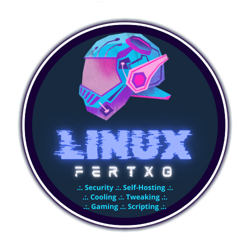

<h1>
    

        
         
        My Docker services for Homelabbing
        <h2>

            A commented⁽¹⁾ selection of stacks that I hope will inspire your projects
        </h2>
        <h5>
            ⁽¹⁾ Note: All README have english translation, but comments inside individual files are only in Spanish at the moment.
        </h5>
    
 
</h1>

### Repository structure:

* Each service has its own folder and `README.md`. Check out each one to better understand how they work.
* They can be run from CLI or be imported to Portainer, Dockge...
* Although they can be deployed at any time, it's interesting to follow this order to fulfill dependencies:

      1. Socket Proxy
      3. Traefik 
      4. Authelia
      5. Nextcloud
      6. Crowdsec
      7. Any other container with Traefik labels

### What can I learn here?

All services are fully functional, but I am aware that there are different (infinite) ways to approach each one. Although all of them could be improved, I tried that each one have at least one new technique that we can apply in other contexts.

* In Socket Proxy we will see the **general structure of a docker-compose**:
  * Services, networks, volumes and environment variables.
  * The inclusion of `privileged` to create containers with elevated privileges on the host machine.
* In Traefik we will see the **use of labels** and also:
  * The correlation between files within the container and their mount points on the host machine's file system.
  * Create networks external to the compose.
  * Create Tokens on Cloudflare.
* In Authelia we will introduce the **use of secrets** as a security measure for our sensitive data.
  * We will also learn how to generate strong passwords on a Linux system.
  * We will see how to run commands within a container that has not yet been started.
* In Nextcloud we will see a **multi-service compose**:
  * One container for the application, another one for the relational database and another one for the in-memory database.
  * The use of `command` as a mean of launching a container always with the same initial conditions.
* In Crowdsec how to **run commands in a container**:
  * From outside in our shell and from inside with interactive mode.
  * We will also look at the use of _plugins_ in Traefik.
* In OPNdash how to create **preset volumes** in Docker.
* In Proxmox Backup Server how to **create a preset volume** but have the container see it **as a physical storage device**.
* And other things I'll think about along the way...

### To-Do List:
- [x] _Docker Socket Proxy_
- [x] _Træfik_
- [x] _Authelia_
- [x] _Nextcloud_
- [x] _Crowdsec_
- [ ] Atuin
- [ ] Cloudflare DDNS
- [ ] Code Server
- [ ] Dashy ***Current WIP***
- [ ] jDownloader
- [ ] MariaDB
- [ ] Minecraft Bedrock Server
- [ ] OPNSense Dashboard
- [ ] Proxmox Backup Server
- [ ] Proxmox Dashboard

### Content creators who inspired me and material in which I've relied

Today almost everything is invented. Each case is unique and you've to adapt all the info on Internet to your needs. I wouldn't have begun if it weren't for the countless gentle experts who we're lucky to have nowadays on Internet. Therefore,

## Infinite thanks to:

* **Timothy Stewart (Techno Tim)**
    * __[Website](https://technotim.live)__
    * __[YouTube](https://www.youtube.com/@technotim)__
* **Jay LaCroix (Learn Linux TV)**
    * __[Website](https://www.learnlinux.tv)__
    * __[YouTube](https://www.youtube.com/@LearnLinuxTV)__
* **Carlos (Computadoras y Sensores)**
    * __[YouTube](https://www.youtube.com/@ComputadorasySensores)__
    * __[Github](https://github.com/computadorasysensores)__
* **Anand (Smart Home Beginner)**
    * __[Website](https://www.smarthomebeginner.com)__
    * __[YouTube](https://www.youtube.com/@AnandsLab)__
* **Christopher Barnatt (Explaining Computers)**
    * __[Website](https://explainingcomputers.com)__
    * __[YouTube](https://www.youtube.com/@christopherbarnatt)__
* **The Linux de facto Bible**
    * __[Arch Linux Wiki (btw)](https://wiki.archlinux.org/title/Main_page)__ 😎
* **Online docs**
    * **[Docker](https://docs.docker.com)**
    * **[Traefik](https://doc.traefik.io/traefik/)**
    * **[Authelia](https://www.authelia.com/overview/prologue/introduction/)**

**To every developer whose containers I've used in my projects. There's a reference to their work within each `README.md`. Thank you all for your effort and willingness to share.**