<h1>
  <p align="center" width="100%">
    
    </br></br>
    Authelia
    <h2><p align="center">
      Authelia is a 2FA & SSO authentication server dedicated to the security of applications and users.
    </h2>
  </br>
  </p> 
</h1>

[](README.md)

### Based on the image from [Authelia](https://www.authelia.com): [authelia](https://github.com/authelia/authelia/pkgs/container/authelia)

- [Based on the image from Authelia: authelia](#based-on-the-image-from-authelia-authelia)
- [Structure](#structure)
- [Explanation](#explanation)
  - [*Authelia config*](#authelia-config)
  - [*User config*](#user-config)
  - [*Other remarks*](#other-remarks)
  - [*Environment variables*](#environment-variables)
  - [*Before start*](#before-start)
- [First run and device register](#first-run-and-device-register)

### Structure

    authelia/
      ├─ docker-compose.yml               → dockerfile
      ├─ .env                             → environment variables
      ├─ config/
      │    ├─ configuration.yml           → main config file
      │    ├─ users_database.yml          → user database
      │    ├─ authelia.log                → log file, generated at startup
      │    ├─ db.sqlite3                  → SQLite database, generated at startup
      │    ├─ notification.txt            → notification system for identity checks, generated at first use
      │    └─ secrets/                    → passwords & keys
      │         ├─ jwt_secret
      │         ├─ session_secret
      │         ├─ storage_encryption_key
      │         └─ authelia_session_redis_password
      └─ redis/                           → Redis server data

### Explanation

Authelia config can be very complex. Here we've chosen for a simple approach that will work for one user or a few of them. For more advanced options we will have to refer to the [official Authelia documentation](https://www.authelia.com/configuration/prologue/introduction/).

The `docker-compose.yml` and `.env` files, as always, need no introduction. They are the files that contain all the instructions and variables to create the Authelia stack.

#### *Authelia config*

The `configuration.yml` file contains the entire Authelia config. Here are some highlights:

  * The `server:` block has been updated to the latest syntaxis as `host:` and `port:` keys are deprecated. Instead, the new `address:` key is used with format **`[<scheme>://][hostname]:<port>[/<path>]`** , e.g.: `tcp://:9091`. The old keys have been kept (and commented out) in case you find other tutorials out-of-date out there.
  * The `authentication_backend:` block defines what type of user database and encryption algorithm are used.
  * The `access_control:` block defines access rules.
  * The `session:` block defines the sessions' lifetime, as well as the address and port where lies the redis server, whose function is to keep this data cached in memory.
  * The `regulation:` block defines how failed attempts are handled.
  * The `storage:` block defines how data is stored.
  * The `notifier:` block defines how users will be notified of actions to verify their identity.

The `secrets` subfolder contains the keys and passwords that will be used in the Authelia config. Each file will contain a key that according to the official documentation...

> It’s **strongly recommended** this is a Random Alphanumeric String with 64 or more characters.

We need to generate one for each file, i.e. four in total.
How do we generate them? We have many options from the Linux shell:

```bash
# With openssl (available by default in most distributions):
  openssl rand -hex 64
# With pwgen (needs to be installed):
  pwgen -s 64
# With Docker and the Authelia container itself (does not need to be running yet):
  docker run --rm authelia/authelia:latest authelia crypto rand --length 64 --charset alphanumeric
# Without any type of tool installed:
  date +%s | sha256sum | base64 | head -c 64 ; echo
```

Or with your favorite online tool: [IT-Tools](https://it-tools.tech/token-generator), [Generate Random](https://generate-random.org/api-token-generator )...

#### *User config*

The `users:` block of the `users_database.yml` file in turn contains a block for each user we configure:

```yaml
users:
  johndoe:
    displayname: "John Doe"
    password: "" → There's a big gap here, but don't worry, we'll fill it in the next step. 😉
    email: johndoe@example.com
    groups:
      - admins
      - dev
  # user2:
    # etc...  
```
</br>

Sure enough, **password is empty**. To generate one according to the algorithm we've defined in the `configuration.yml` file, we can use the `authelia crypto hash` command.

*But we don't have Authelia running yet!* I hear you exclaim... Don't worry, what we'll do is ask the container to run it. As this is the first time that we ask Docker to do something with Authelia, the first thing it will do is download the image (which we'll already have in advance for later), so we will have to wait a while to get the result. Here's the command:

```bash
docker run authelia/authelia:latest authelia crypto hash generate argon2 --password PASSWORD
```

Replace PASSWORD with your real password and cut from the first `$` symbol till the end of the line and paste it within the `""` in the `password:` block.

> **Tip**: ***if we put a space before the whole command we will be telling the Shell not to store the line in the history.*** 😎

#### *Other remarks*

Inside the `redis/` folder some files will be generated that we don't really have to do anything with. You can create a docker volume instead of a bind mount.

The service is based on Træfik, although it can be adapted to other reverse proxies.

#### *Environment variables*

* `PUID` and `PGID` are the user and group IDs in numeric format (run `id` to find them)
* `TZ` is the time zone in `Continent/City` format. [List of zones](https://www.joda.org/joda-time/timezones.html)
* `DOCKERDIR` is the parent directory containing all Docker services.
* `DOMAINNAME` is the name of our domain.

#### *Before start*

Create the structure shown above. It's interesting that both the `secrets` folder and the files inside it all have permissions 600 (rw- --- ---).

Make sure that both the files in the `secrets` folder and our user's password in the `users_database.yml` file have some content.

The `proxy` network must be present before compose is started.

The `traefik` container must be up and running beforehand.

### First run and device register

```bash
docker compose up -d      → run Authelia in the background

docker logs authelia -f   → examine the logs to see if there are any problems (CTRL+c to exit)
```

</br>

After checking the log and be sure that everything is going well, we'll go to the address that we've configured previously in `docker-compose.yml` (the `auth.$DOMAINNAME` line) and proceed with the following steps **(screenshots in Spanish)**:

  <p align="center" width="100%">
    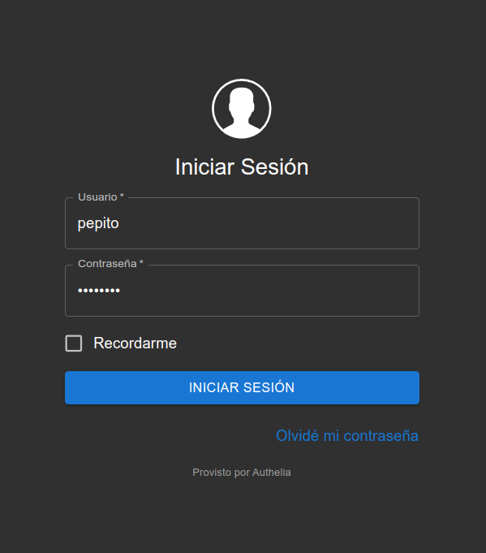
    </br>Enter your credentials
  </p>

</br>

  <p align="center" width="100%">
    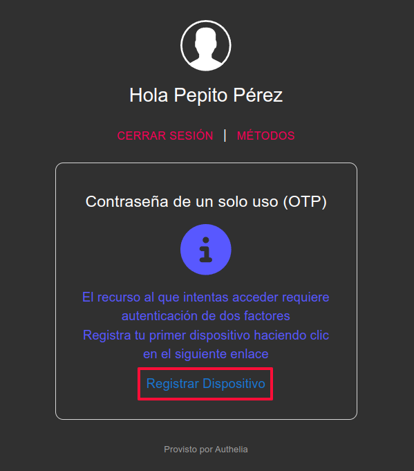
    </br>Click on Register Device
  </p>

</br>

  <p align="center" width="100%">
    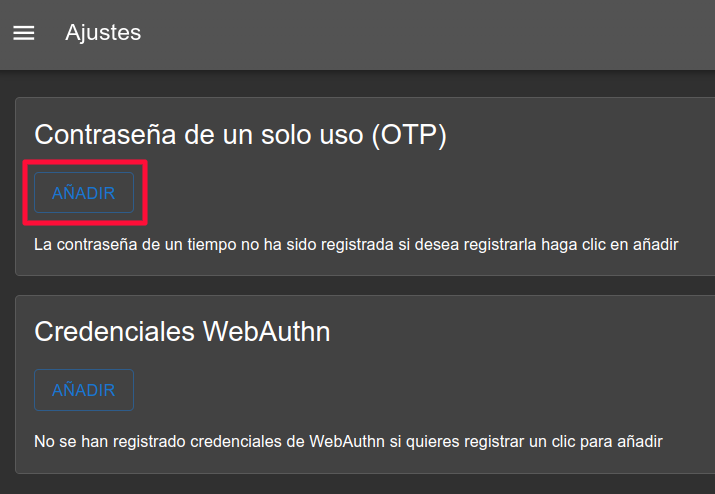
    </br>We'll start by setting a One Time Password first
  </p>

</br>

  <p align="center" width="100%">
    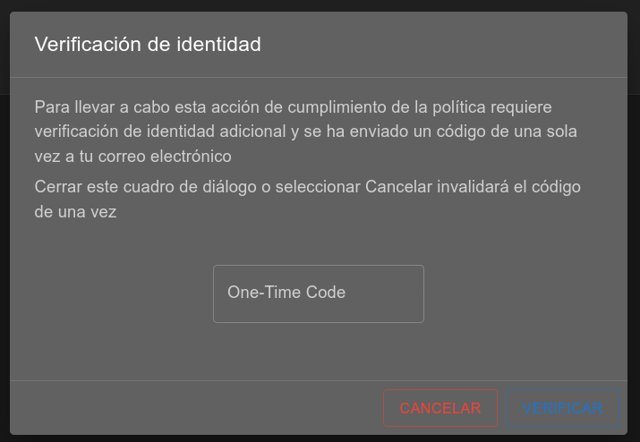
    </br>It warns us that we will receive an email... which will never arrive because we don't have configured any email server. We go to the `notification.txt` file in the `config/` folder.
    </p>

</br>

  <p align="center" width="100%">
    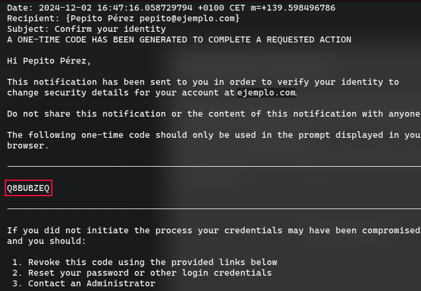
    </br>Copy the random code and paste it in the previous dialogue
  </p>

</br>

  <p align="center" width="100%">
    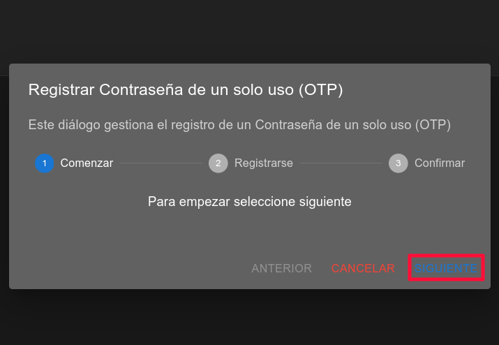
    </br>Click on NEXT
  </p>

</br>

  <p align="center" width="100%">
    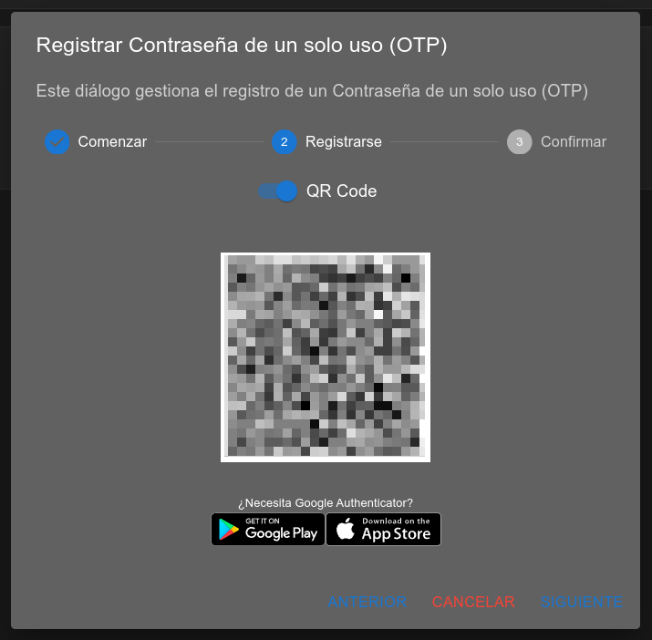
    </br>Scan the QR code with your favourite app. In my case I chose <a href="https://play.google.com/store/apps/details?id=com.authy.authy&hl=es&pli=1">Authy for Android</a>
  </p>

</br>

  <p align="center" width="100%">
    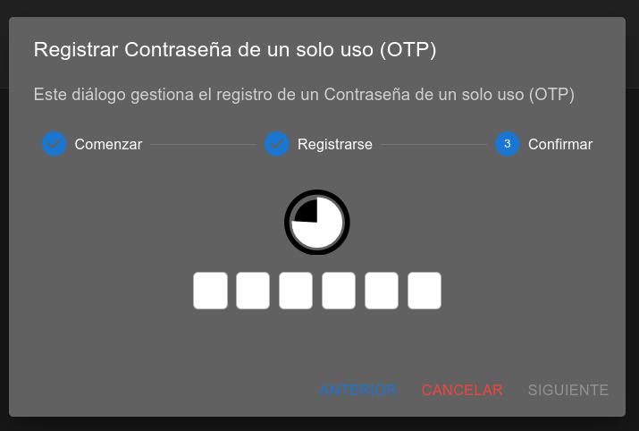
    </br>Enter the timed generated code
  </p>

</br>

  <p align="center" width="100%">
    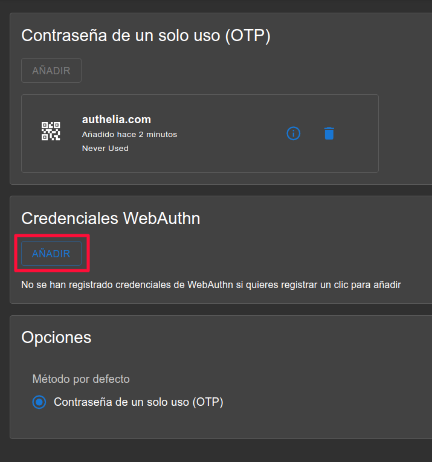
    </br>Well we now have a second factor configured! Now let's try with a physical device. Click ADD in WebAuthn Credentials  </p>

</br>

  <p align="center" width="100%">
    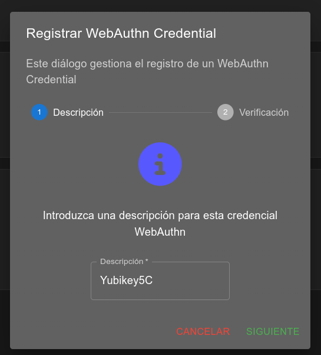
    </br>In this case we will register a Yubikey 5C
  </p>

</br>

  <p align="center" width="100%">
    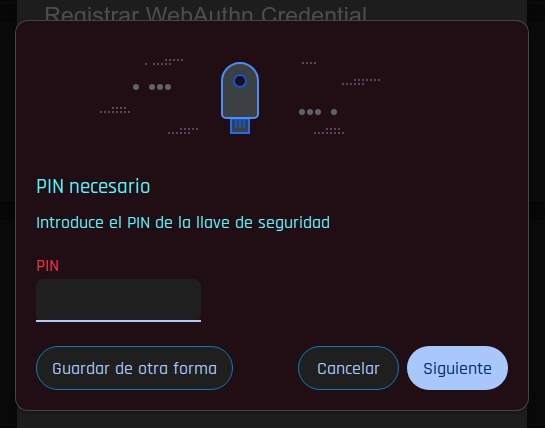
    </br>Enter the PIN if you've one configured
  </p>

</br>

  <p align="center" width="100%">
    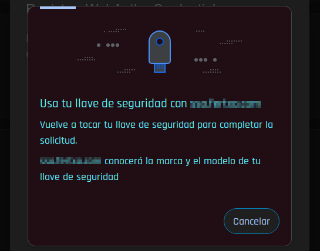
    </br>Touch the physical button on the Yubikey
  </p>

</br>

  <p align="center" width="100%">
    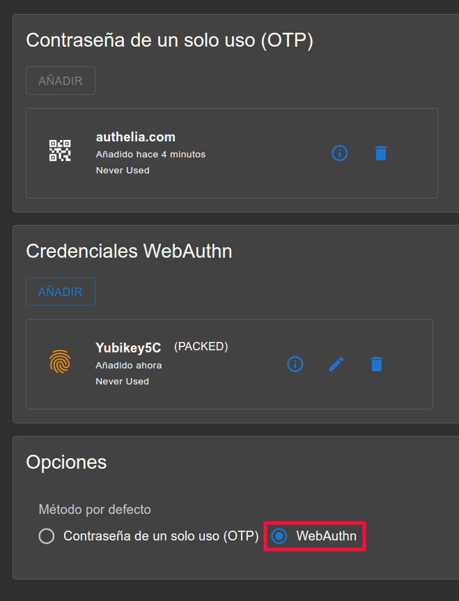
    </br>And finally, here we can choose the method that will be presented by default. We can always say which one when it's requested, this is just a preference.
  </p>

</br>

Done! We can now access our applications with two-factor authentication.
