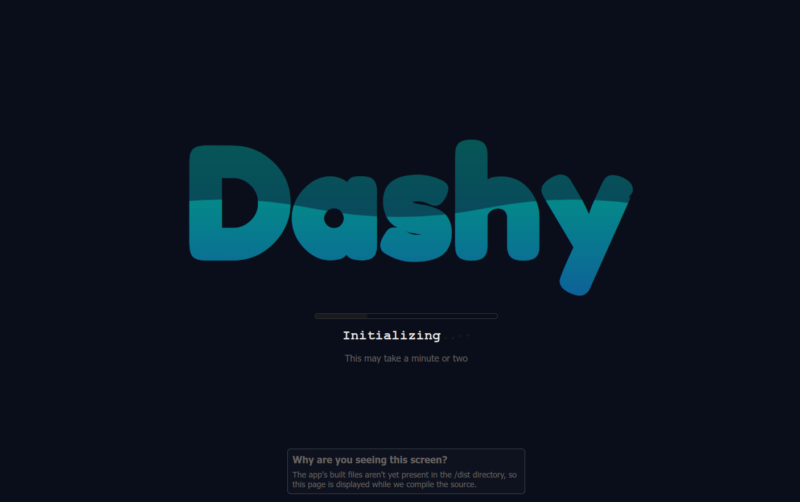
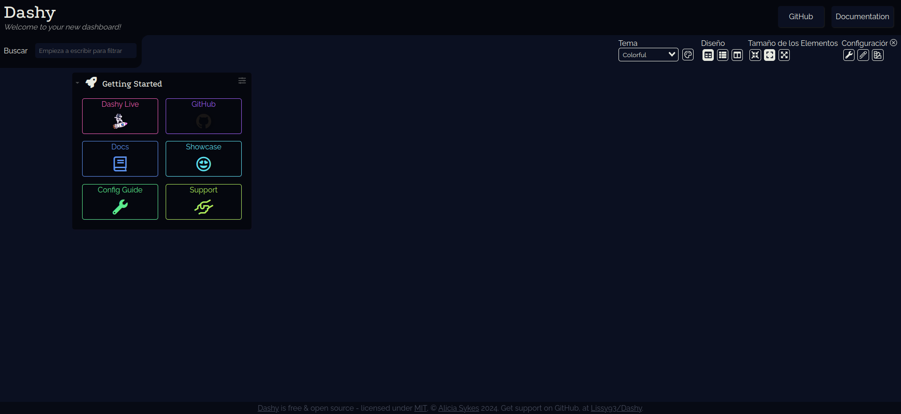
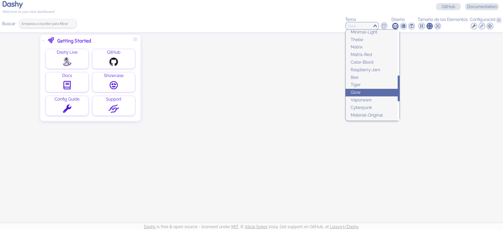
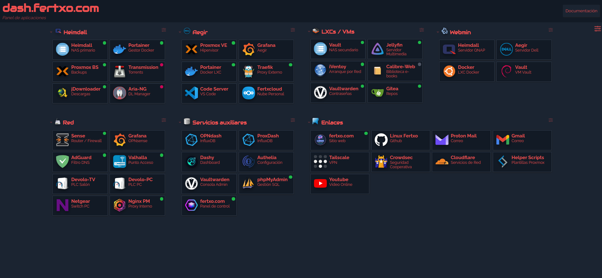

<h1>
  <p align="center" width="100%">
    
    </br>
    Dashy
  </p> 
</h1>

<h2> 
  <p align="center" width="100%">
    An outstanding dashboard with widgets, status-checks, and a full WYSIWYG editor with infinite (<i class="fa-brands fa-js"></i>) posibilities
  </p>
</h2>

<h3>
  <p align="center" width="100%">
    Based on the <a href="https://github.com/Lissy93/dashy">image</a> from <a href="https://www.aliciasykes.com">Alicia Sykes</a> (<a href="https://github.com/Lissy93">@Lissy93</a>)
  </p>
</h3>

[](README.es.md)

<h3>Content:</h3>

- [Structure](#structure)
- [Description](#description)
  - [*Docker compose*](#docker-compose)
    - [*Ports*](#ports)
    - [*SSL Certificates*](#ssl-certificates)
    - [*Healthcheck*](#healthcheck)
  - [*The `dashy.yml` file*](#the-dashyyml-file)
  - [*The `icons/` folder (and maybe `fonts/`)*](#the-icons-folder-and-maybe-fonts)
  - [*Dashy features*](#dashy-features)
    - [*Widgets*](#widgets)
    - [*Status Indicators*](#status-indicators)
    - [*Theming*](#theming)
    - [*Authentication*](#authentication)
    - [*Cloud backup and restore*](#cloud-backup-and-restore)
    - [*Icons*](#icons)
  - [Before starting](#before-starting)
- [First run](#first-run)

## Structure

    dashy/
      ├─ docker-compose.yml               → docker file
      ├─ .env                             → environment variables
      ├─ dashy.yml                        → dashy configuration file (optional)
      ├─ icons/                           → custom icons (optional)
      └─ fonts/                           → custom fonts (optional)

## Description

The `docker-compose.yml` and `.env` files, as always, need no introduction. These are the files that contain all the instructions and variables to create the Dashy stack. Let's talk about some blocks within the `docker-compose.yml` file.

### *Docker compose*

#### *Ports*

```yaml
    ports:
      - $HTTP:8080
```
>

Here I'd like to point out that host side port have been assigned to a variable, so you can suit to your needs. Change it in `.env` accordingly.

This deviation from the default way of assigning ports is due to the fact that you (probably) already have a lot of ports in use on your server. You can always hard-code it if you do prefer. In either case you can see an example in the `.env` provided file.

#### *SSL Certificates*

```yaml
    volumes:
      - $ACME_PATH/example.cer:/etc/ssl/certs/dashy-pub.pem:ro
      - $ACME_PATH/example.key:/etc/ssl/certs/dashy-priv.key:ro
```
>

In case you want to use your own certificate, you want to uncomment those lines in the `volumes` section. Then adjust `$ACME_PATH` variable to point to the location of your certificate files in `.env` file.

#### *Healthcheck*

Just at the bottom of `docker-compose.yml` you can see the healthcheck section. 

```yaml
    healthcheck:
      test: ['CMD-SHELL', 'yarn health-check']
      interval: 5m
      retries: 3
      start_period: 1m
      timeout: 30s
```
>

Here we're using `yarn health-check` shell command (`CMD-SHELL`) to check the status of the container, at intervals of 5 minutes, up to 3 retries, with a start period of 1 minute and a timeout of 30 seconds.

> **What is Yarn?**
> Yarn is a package manager for node.js and it's built-in to the Dashy image, as her developer made use of it to build the Dashy app.

> **New learning topic: Container Health-Checks**
> From here on, **we can use other commands** that we know are inside a container, with the same syntax, **to perform our own checks**. Or create our own docker images with the commands that are more relevant to us.

### *The `dashy.yml` file*

If we have a custom configuration file, we can pass it to the container by binding it. If not present, Dashy will create a default one inside the container. From there we can make our changes. There are three ways to make our modifications:

* **Direct Method:** Edit the `dashy.yml` file with your favorite editor then passing it to the container. Click [here](https://dashy.to/docs/configuring#contents) to access the full documentation.
* **From the UI with the Built-in JSON editor:** Which includes syntax validation, some documentation, and other advanced options. It is available via the spanner-shaped icon in the **≡** settings menu.
* **From the UI with the Visual Editor:** Which provides a convenient way to see the results as we configure it. It can be accessed via the pencil-shaped icon in the **≡** settings menu.

However, what I recommend is begin with the default, empty config (no `dashy.yml`), then build the structure with the Visual Editor, and finally use the Integrated JSON Editor if you need to access more advanced tweaks that are otherwise inaccessible.

### *The `icons/` folder (and maybe `fonts/`)*

Although Dashy provides many ways to add icons to our dashboard (we'll see that in a moment), it's possible that the ones offered don't satisfy us or we want to add our own. To make it happen, you want to bind the `icons/` directory to a host folder and then reference it in `docker-compose.yml`. This way any icon you drop inside the folder will be available for use in the dashboard.

> ***Tip:*** 
> You can also uncomment the line 31 in the volumes section of `docker-compose.yml` to bind the `fonts/` folder and include any custom fonts you want to use.

### *Dashy features*

#### *Widgets*

Dashy has a rich set of widgets that can be used to display information in the dashboard, from both local and remote sources. You can find them in the [Widgets](https://dashy.to/docs/widgets) section of the documentation.

#### *Status Indicators*

Dashy also has status checks you can configure to monitor the availability of your services. They can be configured to circumvent non-SSL services if necessary, set custom headers and more. You can also use them to monitor a different endpoint (URL/Path) in order to get a 200 response, or simply to accept different status codes. You can find all in the [Status Indicators](https://dashy.to/docs/status-indicators) section of the documentation.

#### *Theming*

Dashy boasts a nice set of pre-defined themes you can use to customize your dashboard. Every single item can be tweaked to your liking, from colours, fonts, css styles and more. And of course you can upload your full custom theme (advanced topic). Find more in the [Themes](https://dashy.to/docs/themes) section of the documentation.

#### *Authentication*

Since this guide assumes that you want the Dashboard for personal use and from your local network, it's out of the scope to explain how to configure authentication, but I'll tell you in advance that you'll be given plenty of options to do so. You will find all in the [Authentication](https://dashy.to/docs/authentication) section of the documentation.

#### *Cloud backup and restore*

One neat feature of Dashy is the ability to backup and restore your config in the cloud. The dev Lissy claims that it's encrypted and 100% secure, so you can trust her and make use of it (or not). Personally I've been using it for a while now and I'm very happy with it. You can find this feature in the spanner-shaped icon in the **≡** settings menu.

> ***But beware:*** 
> Always make a backup of your configuration outside this cloud backup, as it relies on cookies to carry backups over same generated password. If you accidentaly or intentionally clear the cookies, **the remote backup will be lost!**
> Best way to achieve this is to open the Built-in JSON Editor, copy all contents and paste them somewhere else. **Also note that you're backing up a JSON file, not YAML**, so it can't be used as `dashy.yml` in `docker-compose.yml`. If you must, start from scratch and then restore your backup inside the JSON built-in editor. It's far easier than converting JSON to YAML.

#### *Icons*

Dashy supports multiple different providers to add icons to your dashboard:

* **Favicons:** Dashy can auto-fetch an icon for a given service, using it's favicon. Just set `icon: favicon` to use this feature.Since different websites host their favicons at different paths, for the best results Dashy can use an API to resolve a websites icon. The default favicon API is allesedv.com, but you can change this under `appConfig.faviconApi`. If you'd prefer not to use an API, just set this value to `local`. You can also use different APIs for individual items, by setting icon: `favicon-[api]`, e.g. `favicon-clearbit`.
The following favicon APIs are supported:
  * **allesedv** - allesedv.com is a highly efficient IPv6-enabled service.
  * **iconhorse** - [Icon.Horse](https://icon.horse/) returns quality icons for any site, with caching for speed and fallbacks for sites without an icon.
  * **clearbit** - [Clearbit](https://clearbit.com/logo) returns high-quality square logos from mainstream websites.
  * **besticon** - [BestIcon](https://github.com/mat/besticon) fetches websites icons from manifest.
  * **mcapi** - [MC-API](https://eu.mc-api.net/) fetches default website favicon, originally a Minecraft util.
  * **duckduckgo** - Returns decent quality website icons, from DuckDuckGo search.
  * **google** - Official Google favicon API service, good support for all sites, but poor quality.
  * **yandex** - Lower quality icons, but useful in some regions where other services are blocked.
  * **local** - Set to local to fetch the default icon at /favicon.ico instead of using an API
  * If for a given service none of the APIs work in your situation, and nor does local, then the best option is to find the path of the services logo or favicon, and set the icon to the URL of the raw image. For example, icon: `https://monitoring.local/faviconx128.png` - you can find this path using the browser dev tools.
* **Font Awesome:** You can use any Font Awesome Icon simply by specifying it's identifier. This is in the format of `[category] [name]` and can be found on the page for that icon on the Font Awesome site. For example: `fas fa-rocket`, `fab fa-monero` or `fas fa-unicorn`. Font-Awesome has a wide variety of free icons, but you can also use their pro icons if you have a membership.
* **Simple Icons:** [SimpleIcons.org](https://simpleicons.org) is a collection of 2000+ high quality, free and open source brand and logo SVG icons. Usage of which is very similar to font-awesome icons. First find the glyph you want to use on the website, then just set your icon  prefixed with `si-`.
* **Generative Icons:** To uses a unique and programmatically generated icon for a given service just set icon: generative. This is particularly useful when you have a lot of similar services with a different IP or port, and no specific icon. These icons are generated with [DiceBear](https://api.dicebear.com/) (or [Evatar](https://evatar.io/) for fallback), and use a hash of the services domain/ip for entropy, so each domain will have a unique icon.
* **Emoji Icons:** You can use almost any emoji as an icon for items or sections. You can specify the emoji either by pasting it directly, using it's unicode ( e.g. `'U+1F680'`) or shortcode (e.g. `':rocket:'`). You can find these codes for any emoji using [Emojipedia](https://emojipedia.org) (near the bottom of emoji each page).
* **Home-Lab Icons:** The [dashboard-icons](https://github.com/walkxcode/Dashboard-Icons) repo by [@WalkxCode](https://github.com/walkxcode) **(thank you from here!!)** provides a comprehensive collection of 360+ high-quality PNG icons for commonly self-hosted services. Dashy natively supports these icons, and you can use them just by specifying the icon name (without extension) preceded by `hl-`. See [here](https://github.com/walkxcode/Dashboard-Icons/tree/main/png) for a full list of all available icons. Note that these are fetched and cached straight from GitHub, so if you require offline access, the Local Icons method may be a better option for you. **Personally I've been using a local cached copy of this repo in the `icons/` folder, along with some custom ones**. The result is what you can see in the screenshots below.
* **Material Design Icons:** Dashy also supports 5000+ [material-design-icons](https://github.com/Templarian/MaterialDesign). To use these, first find the name/slug for your icon [here](https://dev.materialdesignicons.com/icons), and then prefix it with `mdi-`.
* **Icons by URL:** You can also set an icon by passing in a valid URL pointing to the icons location. For example icon: `https://i.ibb.co/710B3Yc/space-invader-x256.png`, this can be in .png, .jpg or .svg format, and hosted anywhere (local or remote) - so long as it's accessible from where you are hosting Dashy. The icon will be automatically scaled to fit, however loading in a lot of large icons may have a negative impact on performance, especially if you visit Dashy from new devices often.
* **Local Icons:** As stated above, the most reliable way is to bind mount the `icons/` folder in our `docker-compose.yml` file. This way any icons you drop inside the folder will be always available, no matter what connectivity issues you might have.

### Before starting

* If you plan to use the config file or custom icons/fonts, make sure you have the folder structure and files ready beforehand.

## First run

```bash
# run Dashy in dettached mode (background)
docker compose up -d

# examine the logs to see if there are any problems (CTRL+c to exit)
docker logs dashy -f
```
>

Open your browser and navigate to the address and port that we've configured previously in `docker-compose.yml`. During the first run the app must build itself, specially if we haven't bind any custom `dashy.yml` file, so we'll be greeted with the following screen:

  <p align="center" width="100%">
    
    <figcaption align="center"><i>Dashy Startup Screen</i></figcaption>
  </p>


</br>

This is what we've been looking for. Once the app is up and running, we can start using it.

  <p align="center" width="100%">
    
    <figcaption align="center"><i>Default Dashy Dashboard</i></figcaption>
  </p>

  <p align="center" width="100%">
    
    <figcaption align="center"><i>Light themes also included (much to my regret) </i>😜</figcaption>
  </p>

</br>

Here's a screenshot of my own dashboard

  <p align="center" width="100%">
    
    <figcaption align="center"><i>Note some custom icons and status checks</i></figcaption>
  </p>

</br>
<h3>
Done! Now we have a brand new dashboard ready to be the envy of our friends!
</h3>
</h4>
I mean it will increase our productivity... ahem
</h4>
