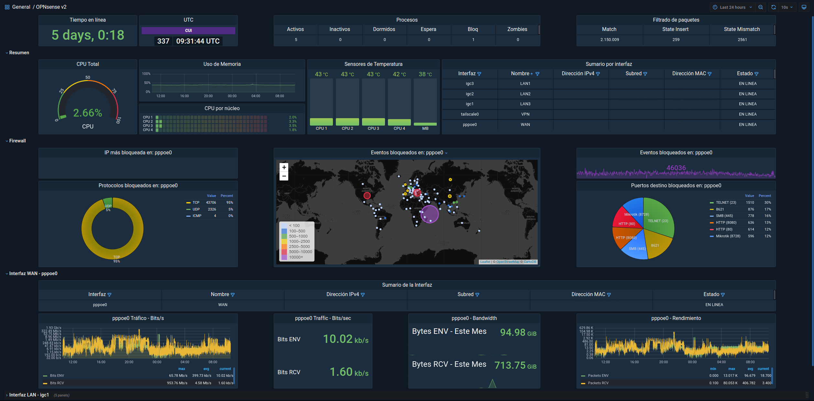

<h1>
  

    
      
    OPNsense Dashboard
  
 
</h1>

<h4> 
  

  A dashboard for OPNsense forked from Brendan Smith (bsmithio), and tweaked by myself. 
	Based on InfluxDB, Graylog, Mongo, ElasticSearch and Grafana
  

   
</h4>

### COMING SOON™
