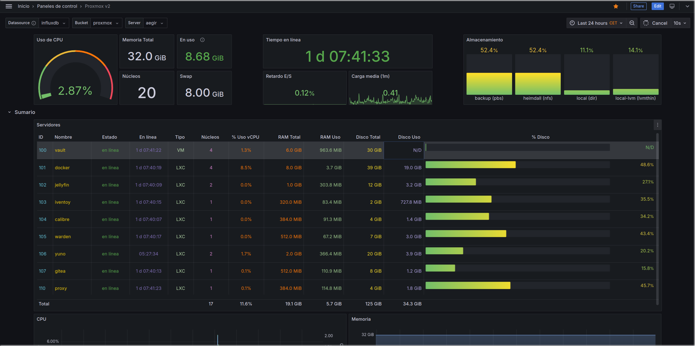

<h1>
  <p align="center" width="100%">
    
    </br>
    Proxmox Dashboard
  </p> 
</h1>

<h2> 
  <p align="center" width="100%">
    A dashboard for Proxmox VE based on <a href="https://www.smarthomebeginner.com/proxmox-grafana-dashboard/">Anand's from Smart Home Beginner</a>, and tweaked by myself.</br>
	Relies on InfluxDB and Grafana
  </p>
</h2>

[](README.es.md)


<h3>
  Content:
</h3>

- [Structure](#structure)
- [Description](#description)
  - [*_Assumptions_*](#assumptions)
  - [*_Environment Variables_*](#environment-variables)
  - [*_Before starting_*](#before-starting)
- [Starting the container and initial configuration](#starting-the-container-and-initial-configuration)
  - [_*InfluxDB configuration*_](#influxdb-configuration)
  - [_*Proxmox VE configuration*_](#proxmox-ve-configuration)
  - [_*Verify Proxmox metrics on InfluxDB*_](#verify-proxmox-metrics-on-influxdb)
  - [_*Create InfluxDB read token for Grafana*_](#create-influxdb-read-token-for-grafana)
  - [_*Create the Grafana-InfluxDB connection*_](#create-the-grafana-influxdb-connection)


## **Structure**

    proxdash/
      ├─ docker-compose.yml               → dockerfile
      ├─ .env                             → environment variables
      └─ proxmox_dashboard.json           → dashboard config for Grafana

## **Description**

The `docker-compose.yml` and `.env` files, as always, need no introduction. These are the files that contain all the instructions and variables to create our dashboard services.

The `proxmox_dashboard.json` file holds the dashboard's layout and config for Grafana. It's a nice start point for you to tweak.

### *Assumptions*

I have assumed that you do not yet have any instances of InfluxDB or Grafana running.

Later on, we will have a look at another dashboards for Grafana that also relies on InfluxDB, and it is perfectly possible to maintain a single instance of each container for more than one Docker stack.

However, I have chosen to maintain a separate configuration for each stack in order to facilitate understanding and streamline implementation.

### *Environment Variables*

* `TZ` is the time zone in `Continent/City` format. [List of zones](https://www.joda.org/joda-time/timezones.html)
* `DOCKERDIR` is the root directory containing all Docker services.
* `INF_ADMIN_USERNAME` and `INF_ADMIN_PASSWORD` are the admin's user/passwd for InfluxDB, respectively.
* `INF_ORG_NAME` and `INF_BUCKET_NAME` are the organization and bucket names for InfluxDB, respectively. More on that later.
* Finally `GF_SECURITY_ADMIN_USER` and `GF_SECURITY_ADMIN_PASSWORD` are the admin's user/passwd for Grafana.

### *Before starting*

* As you will soon see, the exposed ports are slightly modified. This is to avoid overlapping with other services.
* We'll start InfluxDB container with user, password, organization and bucket pre-configured.
    * Despite that, sometimes InfluxDB starts in wizard mode. Simply fill with the environment variables' content.
    * User and password are obvious.
    * Organisation allows you to group related data sets under the same name, thus allowing you to keep them separate by organisation or project. In this case, since the database will only be for this dashboard, it is fine to call the organisation ‘proxmox’.
    * Likewise, the ‘bucket’ is where the data coming from the Proxmox server will be dumped. For the sake of simplicity, we will also call it ‘proxmox’.

## **Starting the container and initial configuration**

```bash
docker compose up -d        # start the stack in the background

docker logs prox-influxdb   # examine the InfluxDB logs to see if there are any problems (CTRL+c to exit)
docker logs prox-grafana    # same as above but for Grafana
```
</br>

### *InfluxDB configuration*

In a browser, go to the address of your docker host and influxdb port: `http://docker_host_ip:5086` (Host's 5086 port will be internally sent to port 8086 within the container)

Log in with the InfluxDB credentials and go to Load Data -> Buckets. You should see our "Proxmox" bucket. Click on "Settings" and choose your preferred data keeping policy.

Next go to "API Tokens" tab (also in Load Data section), and generate a new ___custom___ token for Proxmox VE server to be able to send data to InfluxDB. This token only has to have ***write*** privilege to the proxmox bucket we configured earlier.

Hit Generate and copy the token carefully, ***as is only shown this time***. If for somewhat reason you lose it, ***you must generate a new one!***

### *Proxmox VE configuration*

Next, go to your Proxmox VE web interface and search for "Metric Server" under Datacenter section. Happily enough, Proxmox has built-in support for InfluxDB, so click on Add, pick up InfluxDB and provide the connection details:

* Name: Name it as you want
* Server: Docker Host Server's IP (192.168...)
* Port: 5086
* Protocol: HTTP
* Enabled: [x]
* Organization: proxmox
* Bucket: proxmox
* Token: your generated token in previous step

Click on create and proceed to next step.

### *Verify Proxmox metrics on InfluxDB*

Head over to InfluxDB Data Explorer, and pick the proxmox bucket.

If you're able to see items in the "Select measurement" dropdown, then congratulations! You're on the right path.

### *Create InfluxDB read token for Grafana*

At this point you have a Proxmox VE server sending metrics to an InfluxDB docker container. Next step is to grab these data from InfluxDB and create stunning dashboards on Grafana. To do so:

* Go back to InfluxDB -> Load Data -> API Tokens
* Generate a new custom token for Grafana, with only ***read*** privilege to the proxmox bucket.
* Sport the same caution as before, ***copy the token carefully or start over!***

### *Create the Grafana-InfluxDB connection*

Finally go to Grafana web interface on `http://docker_host_ip:5050` and:

* Log in with credentials from Grafana's container environment variables creation.
* From the top-left menu dropdown (a Grafana Logo) select "Connections" -> "Add new connection"
* Browse or search for InfluxDB and select it.
* On the overview page, hit the "Add new data source"" button on top-right corner.
    * Name: As you prefer
    * Query language: Flux
    * HTTP section
        * URL: http://docker_host_ip:5086
    * InfluxDB details
        * Organization: proxmox
        * Token: paste the generated token for Grafana here
        * Default Bucket: proxmox
* Hit "Save & test"

You should read "datasource is working". If not review for any typos/errors.

### Create the Grafana dashboard

Now we are ready for the final step: create a visually appealing dashboard!

* From the top-left menu dropdown select "Dashboards".
* Hit on "New" button onb top-right and select "Import".
* Upload the provided proxmox_dashboard.json or copy-paste its contents on the box below.
* Give the Dashboard a name
* Select the InfluxDB data connection on the last dropdown list.

<h3>
Done! Now you have a nice way to monitor your LXCs and VMs.
</h3>


